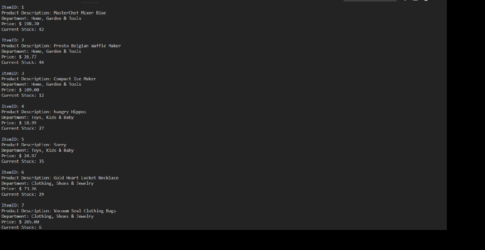
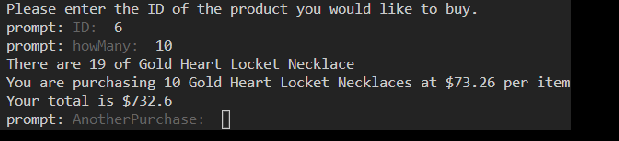
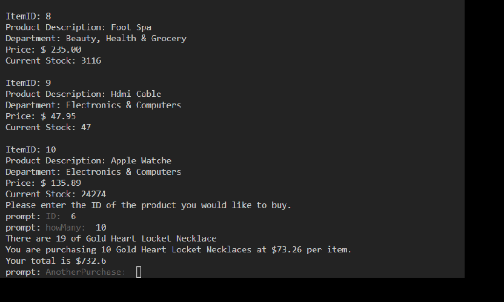

## Node.js & MySQL

### Introduction

* I created an Amazon-like storefront app, called Bamazon, using MySQL, the MySQL NPM Package, and the Prompt Package.
* This app takes in orders from customers and deplete from the store's total supplies.
* The app first displays a list of all of the available products, their costs, and current stock.

* The app asks the following things from the user.

	1. product ID
	2. the amount the user wants to purchase

* The app will display the stock before your purchase, what you are buying, how many, and the unit cost.
* Then it will display the total cost and ask if you want to purchase another item. 

* It must be ran in the command line.
* Type in node main.js to start the app.

* These are the npm packages I used and are needed to run the app

1. fs package in node
2. prompt
3. mysql
	
* to install these npm packages run the following command.

npm install 

# Copyright
Dakota Rodgers 2019/02/19